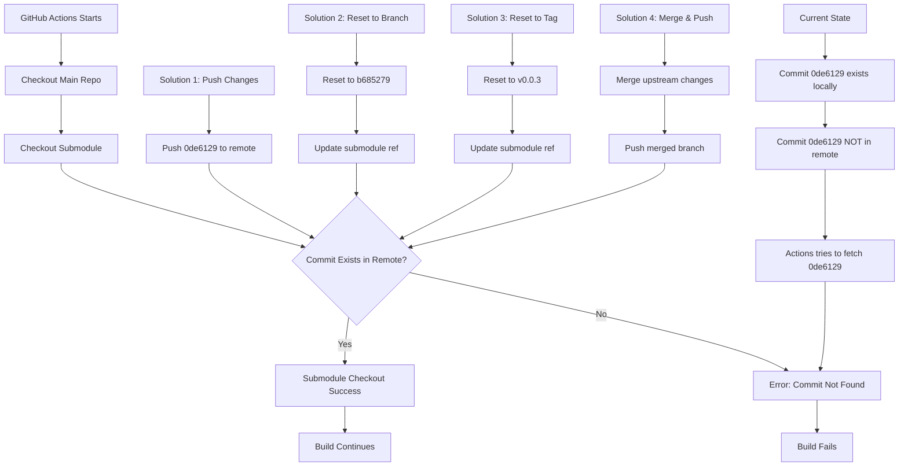

# Fix Submodule Connection Issue

## Problem Summary

The GitHub Actions workflow is failing when trying to checkout the submodule `ergogen/footprints/ceoloide`. The error indicates that a specific commit (`0de6129caa0437b600a85eff43ebfc111cd6f11d`) cannot be found in the remote repository.

## Root Cause Analysis

### Current State

1. **Submodule Configuration** ([`.gitmodules`](.gitmodules:1)):
   ```git
   [submodule "ergogen/footprints/ceoloide"]
       path = ergogen/footprints/ceoloide
       url = https://github.com/Happily-Coding/ergogen-footprints.git
   ```

2. **Submodule Status**:
   ```
   0de6129caa0437b600a85eff43ebfc111cd6f11d ergogen/footprints/ceoloide (v0.0.3-11-g0de6129)
   ```
   - The submodule is pointing to commit `0de6129`
   - This is 11 commits ahead of tag `v0.0.3`
   - The commit is on a detached HEAD state

3. **Local Commits**:
   ```
   0de6129 Add 3d model display
   b685279 Added pos file to switch_choc_v1_v2
   5dc613f Added offsets (poorly named)
   49fb59d Fix footprint module name
   b33bf19 Fix footprint module name
   ```

4. **Remote Repository State**:
   - **Origin** (Happily-Coding/ergogen-footprints):
     - `feature/sweepyway-customizations` branch exists at commit `b685279`
     - Commit `0de6129` does NOT exist in this remote
   - **Upstream** (ceoloide/ergogen-footprints):
     - Main branch at commit `54a23cc`
     - Latest tag is `v0.0.9`
     - Commit `0de6129` does NOT exist in this remote

### The Issue

The submodule is referencing a commit (`0de6129`) that:
- Exists locally in the working directory
- Does NOT exist in the remote `https://github.com/Happily-Coding/ergogen-footprints.git`
- Was never pushed to the remote repository

When GitHub Actions tries to checkout the submodule, it fails because:
```
fatal: remote error: upload-pack: not our ref 0de6129caa0437b600a85eff43ebfc111cd6f11d
fatal: Fetched in submodule path 'ergogen/footprints/ceoloide', but it did not contain 0de6129caa0437b600a85eff43ebfc111cd6f11d. Direct fetching of that commit failed.
```

## Diagnostic Steps

### Step 1: Verify the issue
```bash
git submodule status
```
Expected output shows the problematic commit reference.

### Step 2: Check remote availability
```bash
cd ergogen/footprints/ceoloide
git ls-remote origin | grep 0de6129
```
Expected: No output (commit doesn't exist in remote)

### Step 3: Check local vs remote
```bash
cd ergogen/footprints/ceoloide
git log --oneline -5
git ls-remote origin
```
This shows that the local commits are ahead of the remote.

## Proposed Solutions

### Solution 1: Push Local Changes to Remote Fork (Recommended)

**Prerequisites:**
- Write access to `https://github.com/Happily-Coding/ergogen-footprints.git`

**Steps:**
1. Push the local commits to the remote repository
2. Update the submodule reference in the main repository

```bash
# Navigate to the submodule
cd ergogen/footprints/ceoloide

# Push the local commits to the remote
git push origin HEAD:feature/sweepyway-customizations

# Navigate back to the main repository
cd ../..

# Update the submodule reference
git add ergogen/footprints/ceoloide
git commit -m "Update submodule to latest commit"
git push
```

**Pros:**
- Preserves all customizations
- Maintains the current state of the project
- No loss of work

**Cons:**
- Requires write access to the remote repository
- Requires pushing potentially unreviewed commits

---

### Solution 2: Switch to Existing Remote Branch

**Steps:**
1. Reset the submodule to the remote branch tip
2. Commit the change

```bash
# Navigate to the submodule
cd ergogen/footprints/ceoloide

# Reset to the remote branch tip
git fetch origin
git checkout feature/sweepyway-customizations
git reset --hard origin/feature/sweepyway-customizations

# Navigate back to the main repository
cd ../..

# Update the submodule reference
git add ergogen/footprints/ceoloide
git commit -m "Reset submodule to remote branch tip"
git push
```

**Pros:**
- Uses an existing remote branch
- Preserves most customizations (up to commit `b685279`)
- No write access required to create new commits

**Cons:**
- Loses 1 commit (the "Add 3d model display" commit)
- May require recreating the lost commit

---

### Solution 3: Switch to a Tag (Cleanest but Loses Customizations)

**Steps:**
1. Reset the submodule to an existing tag
2. Commit the change

```bash
# Navigate to the submodule
cd ergogen/footprints/ceoloide

# Reset to a specific tag
git fetch origin
git checkout v0.0.3

# Navigate back to the main repository
cd ../..

# Update the submodule reference
git add ergogen/footprints/ceoloide
git commit -m "Reset submodule to v0.0.3 tag"
git push
```

**Pros:**
- Uses a stable, released version
- No customizations to maintain
- Simple and reliable

**Cons:**
- Loses ALL customizations (12 commits)
- May require recreating all customizations
- May break the build if customizations are required

---

### Solution 4: Merge with Upstream and Push

**Steps:**
1. Merge upstream changes into the local branch
2. Push the merged branch to the remote

```bash
# Navigate to the submodule
cd ergogen/footprints/ceoloide

# Create a local branch from the current state
git checkout -b feature/sweepyway-customizations

# Fetch upstream
git fetch upstream

# Merge upstream main into the branch
git merge upstream/main

# Push to the remote
git push origin feature/sweepyway-customizations

# Navigate back to the main repository
cd ../..

# Update the submodule reference
git add ergogen/footprints/ceoloide
git commit -m "Update submodule to merged branch"
git push
```

**Pros:**
- Incorporates upstream changes
- Preserves customizations
- Keeps the branch up to date

**Cons:**
- Requires write access to the remote repository
- May create merge conflicts
- More complex process

---

## Recommended Action Plan

### Phase 1: Assessment
1. Verify which customizations are critical for the project
2. Check if you have write access to `Happily-Coding/ergogen-footprints`
3. Determine if the lost commit(s) can be recreated if needed

### Phase 2: Implementation
Based on the assessment, choose one of the solutions above:
- **If you have write access and want to preserve everything**: Use Solution 1
- **If you have write access and want to stay current**: Use Solution 4
- **If you don't have write access and can lose 1 commit**: Use Solution 2
- **If you don't have write access and can lose all customizations**: Use Solution 3

### Phase 3: Verification
1. After applying the fix, run the GitHub Actions workflow
2. Verify that the submodule checkout succeeds
3. Verify that the build completes successfully
4. Verify that all generated files are correct

## Workflow Configuration

The current workflow configuration in [`.github/workflows/build.yaml`](.github/workflows/build.yaml:22) is correct:

```yaml
- name: Checkout
  uses: actions/checkout@v4
  with:
    submodules: true
```

This configuration is already set up to handle submodules correctly. The issue is purely with the submodule reference pointing to a non-existent remote commit.

## Additional Considerations

### Future Prevention
To prevent this issue in the future:
1. Always push submodule changes before updating the main repository
2. Consider using tags instead of commit SHAs for submodule references
3. Implement a pre-commit hook to verify submodule references
4. Consider using a CI check to verify submodule references are valid

### Alternative Approach: Remove Submodule
If the submodule is not actively maintained or the customizations are minimal, consider:
1. Removing the submodule reference
2. Copying the necessary files directly into the repository
3. Maintaining them as part of the main project

This eliminates the submodule complexity entirely.

## Mermaid Diagram



## Next Steps

1. Review this plan and decide which solution to implement
2. Verify write access to the remote repository if needed
3. Implement the chosen solution
4. Test the GitHub Actions workflow
5. Verify the build output is correct
