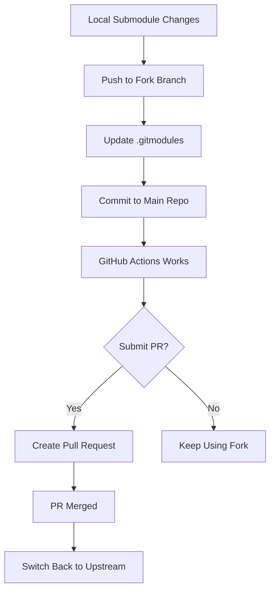

# Git Submodule Fix Plan

## Summary
This plan fixes the GitHub Actions submodule error by forking the ceoloide/ergogen-footprints repository, pushing your local changes to the fork, and updating your project to use the fork. This approach allows you to maintain your custom modifications while also enabling you to contribute them back to the upstream community via a Pull Request.

## Problem Analysis

### The Error
Your GitHub Actions workflow is failing with this error:
```
Error: fatal: remote error: upload-pack: not our ref 5dc613fd9d50e780bbc87466d6432a2e89b413ed
Error: fatal: Fetched in submodule path 'ergogen/footprints/ceoloide', but it did not contain 5dc613fd9d50e780bbc87466d6432a2e89b413ed. Direct fetching of that commit failed.
```

### Root Cause
This error occurs because:

1. **You made local changes** to the ceoloide ergogen-footprints submodule files (specifically [`switch_choc_v1_v2.js`](ergogen/footprints/ceoloide/switch_choc_v1_v2.js))

2. **Git recorded a commit hash** (5dc613fd9d50e780bbc87466d6432a2e89b413ed) in your main repository's git index that points to your local changes

3. **That commit doesn't exist** in the remote repository (https://github.com/ceoloide/ergogen-footprints.git) because you never pushed it there

4. **GitHub Actions tries to fetch** that specific commit hash during checkout, but the remote server doesn't have it, resulting in "not our ref" error

5. **Shallow clone issue**: The GitHub Actions checkout uses `--depth=1` by default, which only fetches the latest commit, not the full history. Even if your commit existed remotely, a shallow clone might not include it.

### Why This Happens
Git submodules work by storing a **specific commit hash** (not a branch) in the parent repository. When you:
- Make changes in the submodule directory
- Commit those changes in the submodule
- Update the parent repository to point to that new commit

Git records the exact SHA-1 hash of that commit. If you don't push that commit to the remote submodule repository, other systems (like GitHub Actions) cannot fetch it.

## Solutions

I've identified **four possible solutions**, ordered from most recommended to least recommended:

### Solution 1: Revert to Upstream Commit (RECOMMENDED)

**Best if:** Your local changes to the ceoloide submodule are not critical or can be recreated differently.

**How it works:**
1. Reset the submodule to the latest commit from the upstream ceoloide repository
2. Update your main repository to point to that commit
3. Push the changes

**Pros:**
- Simplest solution
- Maintains clean dependency on upstream
- No need to fork or maintain your own version
- GitHub Actions will work immediately

**Cons:**
- You lose your local modifications to the ceoloide footprints
- If you need those changes, you'll have to recreate them differently

**Steps:**
```bash
# Reset submodule to latest upstream
cd ergogen/footprints/ceoloide
git fetch origin
git checkout origin/main  # or origin/master, depending on the default branch
cd ../..

# Update parent repository to point to this commit
git add ergogen/footprints/ceoloide
git commit -m "Reset ceoloide submodule to upstream latest"

# Push changes
git push
```

---

### Solution 2: Fork and Use Your Own Fork (RECOMMENDED - CHOSEN APPROACH)

**Best if:** You need to maintain custom modifications to the ceoloide footprints long-term and plan to contribute them back to the upstream community.

**How it works:**
1. Fork the ceoloide/ergogen-footprints repository to your GitHub account
2. Push your local changes to a feature branch on your fork
3. Update `.gitmodules` to point to your fork instead of upstream
4. Push the changes to your main repository
5. Submit a Pull Request to upstream ceoloide repository
6. Once merged, optionally switch back to upstream

**Pros:**
- You keep your custom modifications
- Full control over the submodule
- Can maintain your own version
- Clean separation from upstream
- Easy to contribute back to community
- GitHub Actions will work immediately

**Cons:**
- Requires maintaining your own fork temporarily
- Need to manually sync upstream changes if desired
- Slightly more complex setup

**Detailed Steps:**

#### Step 1: Create the Fork
1. Visit https://github.com/ceoloide/ergogen-footprints
2. Click the "Fork" button in the top-right corner
3. This will create a fork at: https://github.com/HappilyCoding/ergogen-footprints
4. Note: GitHub automatically keeps the repository name the same when forking

#### Step 2: Push Local Changes to Your Fork
```bash
# Navigate to the submodule directory
cd ergogen/footprints/ceoloide

# Add your fork as a remote
git remote add fork https://github.com/HappilyCoding/ergogen-footprints.git

# Create a feature branch for your changes
git checkout -b feature/sweepyway-customizations

# Push your changes to your fork
git push fork feature/sweepyway-customizations

# Go back to the main repository
cd ../..
```

#### Step 3: Update .gitmodules
Edit [`.gitmodules`](.gitmodules) to point to your fork:

```gitmodules
[submodule "ergogen/footprints/ceoloide"]
	path = ergogen/footprints/ceoloide
	url = https://github.com/HappilyCoding/ergogen-footprints.git
```

#### Step 4: Update Git Configuration
```bash
# Sync the submodule configuration
git submodule sync

# Update the submodule to point to your fork's branch
cd ergogen/footprints/ceoloide
git checkout feature/sweepyway-customizations
cd ../..
```

#### Step 5: Commit and Push Changes
```bash
# Stage the changes
git add .gitmodules ergogen/footprints/ceoloide

# Commit the changes
git commit -m "Use HappilyCoding fork of ceoloide ergogen-footprints with custom modifications"

# Push to your main repository
git push
```

#### Step 6: Submit Pull Request to Upstream (Optional but Recommended)
1. Visit your fork: https://github.com/HappilyCoding/ergogen-footprints
2. Click "Contribute" → "Open Pull Request"
3. Add a descriptive title and explain your changes
4. Submit the PR to ceoloide/ergogen-footprints

#### Step 7: After PR Merge (Optional)
Once your PR is merged upstream, you can switch back to using the upstream repository:

```bash
# Update .gitmodules to point back to upstream
# Edit .gitmodules:
# url = https://github.com/ceoloide/ergogen-footprints.git

# Sync and update
git submodule sync
cd ergogen/footprints/ceoloide
git fetch origin
git checkout main  # or the branch that was merged
cd ../..

# Commit and push
git add .gitmodules ergogen/footprints/ceoloide
git commit -m "Switch back to upstream ceoloide ergogen-footprints"
git push
```

**Workflow file update:**
No changes needed to [`.github/workflows/build.yaml`](.github/workflows/build.yaml) since your fork will be public and accessible to GitHub Actions.

**Visual Workflow:**



---

### Solution 3: Move Footprints to Your Repository (ALTERNATIVE)

**Best if:** You want complete independence from the ceoloide repository.

**How it works:**
1. Copy the modified footprint files directly into your repository
2. Remove the submodule
3. Update your ergogen config to reference the local files

**Pros:**
- Complete control
- No submodule complexity
- No external dependencies

**Cons:**
- Lose ability to easily get upstream updates
- Duplication of code
- Harder to maintain if ceoloide makes improvements

**Steps:**
```bash
# 1. Copy the files you need
mkdir -p ergogen/footprints/custom
cp ergogen/footprints/ceoloide/*.js ergogen/footprints/custom/

# 2. Remove the submodule
git submodule deinit -f ergogen/footprints/ceoloide
git rm -f ergogen/footprints/ceoloide
rm -rf .git/modules/ergogen/footprints/ceoloide

# 3. Update .gitmodules to remove the submodule entry
# 4. Update ergogen/config.yaml to reference the new path
# 5. Commit and push
```

---

### Solution 4: Submit PR to Upstream (COMMUNITY APPROACH)

**Best if:** Your changes are improvements that would benefit the ceoloide community.

**How it works:**
1. Fork the ceoloide repository
2. Push your changes to a branch
3. Submit a Pull Request to the upstream repository
4. Once merged, update your submodule to the merged commit
5. Revert your local changes

**Pros:**
- Contributes back to the community
- Your changes get maintained by upstream
- Clean solution

**Cons:**
- Requires upstream approval
- May take time
- Changes might not be accepted as-is

**Steps:**
```bash
# 1. Fork and push your changes (similar to Solution 2)
# 2. Create Pull Request on GitHub
# 3. Wait for merge
# 4. Once merged:
cd ergogen/footprints/ceoloide
git fetch origin
git checkout origin/main
cd ../..
git add ergogen/footprints/ceoloide
git commit -m "Update to upstream with merged changes"
git push
```

---

## GitHub Actions Configuration

Regardless of which solution you choose, your current [`.github/workflows/build.yaml`](.github/workflows/build.yaml:24) configuration is correct:

```yaml
- name: Checkout
  uses: actions/checkout@v4
  with:
    submodules: true
```

The `submodules: true` setting will fetch submodules, and once the commit hash exists in the remote repository, GitHub Actions will be able to fetch it successfully.

## Additional Considerations

### Shallow Clone Depth
The error mentions `--depth=1` which is a shallow clone. If you need to fetch specific commit hashes that aren't the latest, you may need to adjust the checkout action:

```yaml
- name: Checkout
  uses: actions/checkout@v4
  with:
    submodules: true
    fetch-depth: 0  # Fetch full history
```

However, this is usually not necessary if the commit exists in the remote repository.

### Authentication for Private Submodules
If you choose Solution 2 with a **private** fork, you'll need to add authentication to your workflow:

```yaml
- name: Checkout
  uses: actions/checkout@v4
  with:
    submodules: true
    token: ${{ secrets.GITHUB_TOKEN }}  # or use a PAT with repo scope
```

## Recommendation

**I recommend Solution 2 (Fork and Use Your Own Fork)** for your situation because:
- You want to keep your custom modifications
- You plan to contribute them back to the upstream community
- It provides a clear path for both immediate fixes and long-term maintenance
- GitHub Actions will work immediately after implementation

## Quick Reference Commands

```bash
# Complete implementation sequence
cd ergogen/footprints/ceoloide
git remote add fork https://github.com/HappilyCoding/ergogen-footprints.git
git checkout -b feature/sweepyway-customizations
git push fork feature/sweepyway-customizations
cd ../..

# Update .gitmodules to point to fork
# Edit .gitmodules: url = https://github.com/HappilyCoding/ergogen-footprints.git

git submodule sync
cd ergogen/footprints/ceoloide
git checkout feature/sweepyway-customizations
cd ../..

git add .gitmodules ergogen/footprints/ceoloide
git commit -m "Use HappilyCoding fork of ceoloide ergogen-footprints with custom modifications"
git push
```

## Next Steps

Once you're ready to implement this plan, switch to **Code mode** and I'll help you execute these commands step by step.